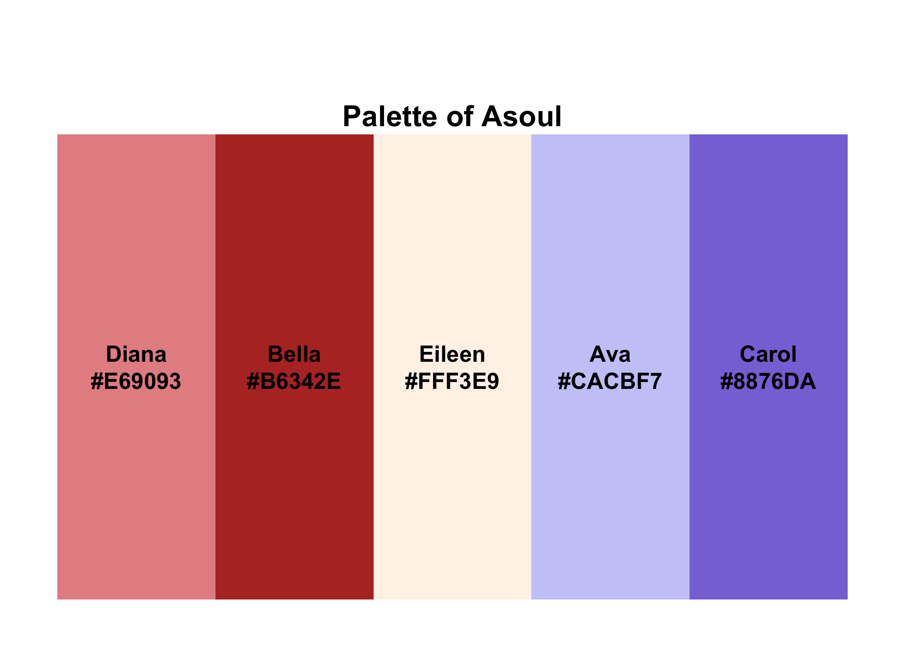
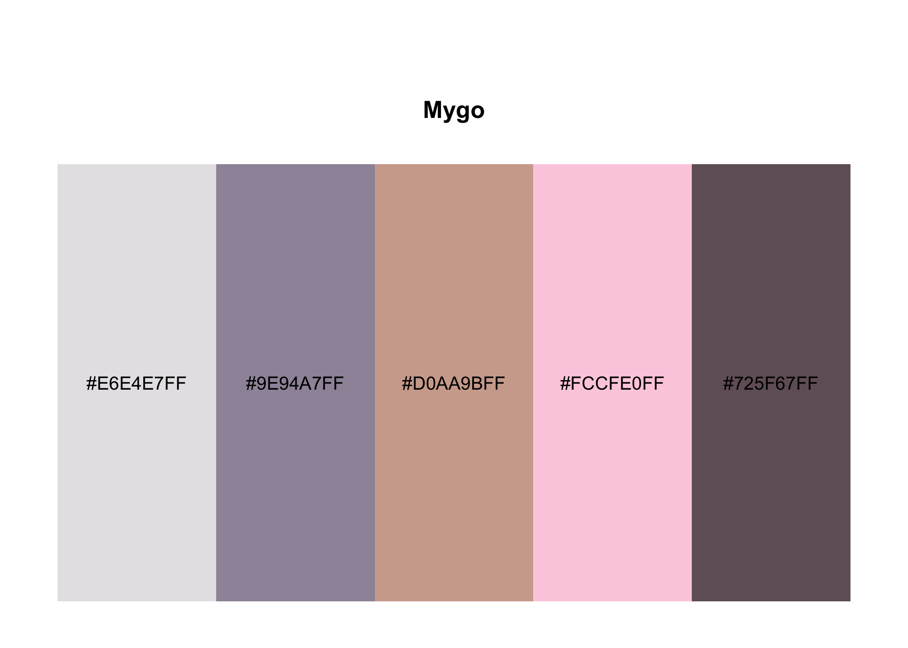
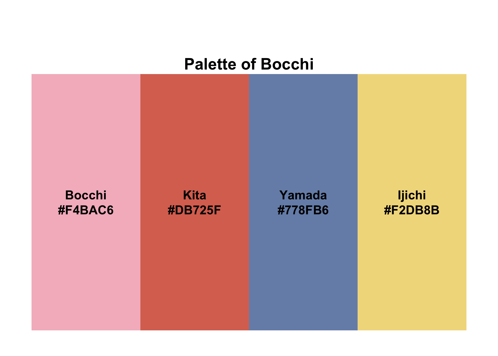

<!-- README.md is generated from README.Rmd. Please edit that file -->

# gganime

A lightweight, **ggsci-style** R package providing **built-in discrete
palettes** inspired by A-SOUL, with drop-in `ggplot2` scales.

“我的嘉心糖都是很厉害的人”——Diana


<!-- badges: start -->

[](https://github.com/lingxuko/gganime/actions/workflows/R-CMD-check.yaml)
[](https://github.com/lingxuko/gganime/actions/workflows/pkgdown.yaml)
<!-- badges: end -->

## Features

- Built-in discrete palettes (named palette registry)
- `ggplot2` scales: `scale_color_anime()` and `scale_fill_anime()`
- Palette utility functions:
  - `anime_palettes()` list available palettes
  - `pal_anime()` returns a palette function (`function(n)`) in **ggsci
    style**
  - `show_anime()` previews palettes with palette name and HEX codes

## Installation

Install the development version from GitHub:

``` r
# install.packages("remotes")
remotes::install_github("lingxuko/gganime")
#> Using GitHub PAT from the git credential store.
#> Skipping install of 'gganime' from a github remote, the SHA1 (029bb0b1) has not changed since last install.
#>   Use `force = TRUE` to force installation
```

## Example

Preview a palette:

``` r
library(gganime)
gganime_palettes()
#> [1] "Asoul"  "Diana"  "Bella"  "Eileen" "Ava"    "Carol"  "Mygo"   "Mujica"
#> [9] "Bocchi"
```

A-Soul:

<div style="display:flex; gap:0px;">


</div>

``` r
show_anime("Asoul")
```



Mygo:

``` r
show_anime("Mygo")
```



Bocchi the Rock!:

<div style="display:flex; gap:0px;">


</div>

``` r
show_anime("Bocchi")
```



Use with ggplot2:

``` r
library(ggplot2)
#> Warning: package 'ggplot2' was built under R version 4.4.3
library(gganime)

set.seed(1)
df <- data.frame(
  x = rnorm(200),
  grp = factor(sample(paste0("G", 1:5), 200, replace = TRUE),
               levels = paste0("G", 1:5))
)

grp_effect <- setNames(c(-1.0, -0.4, 0.0, 0.5, 1.2), paste0("G", 1:5))
df$y <- 0.7 * df$x + grp_effect[as.character(df$grp)] + rnorm(200, sd = 0.6)

ggplot(df, aes(x, y, color = grp)) +
  geom_point(size = 2, alpha = 0.9) +
  scale_color_anime(palette = "Asoul") +
  theme_minimal(base_size = 12)
```


